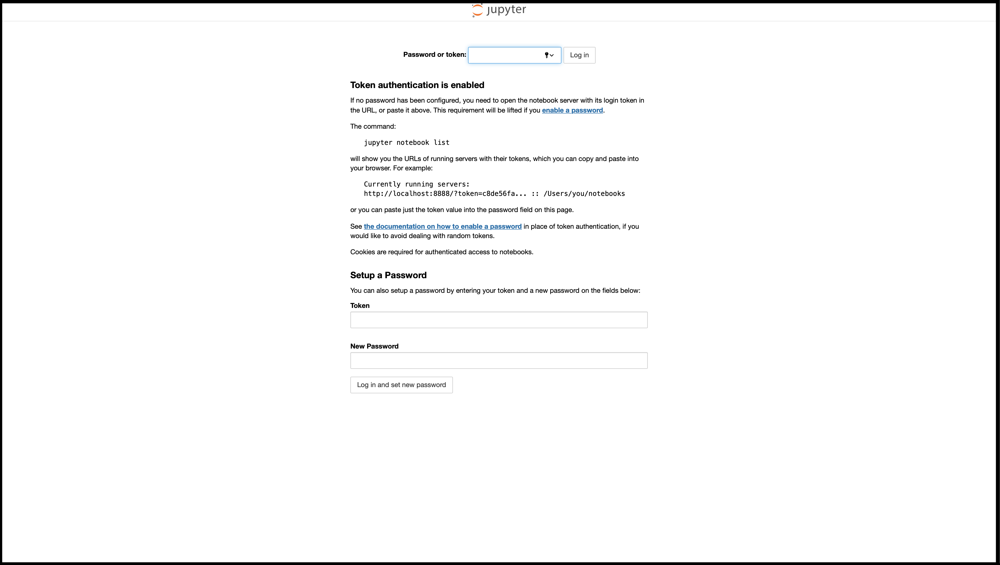
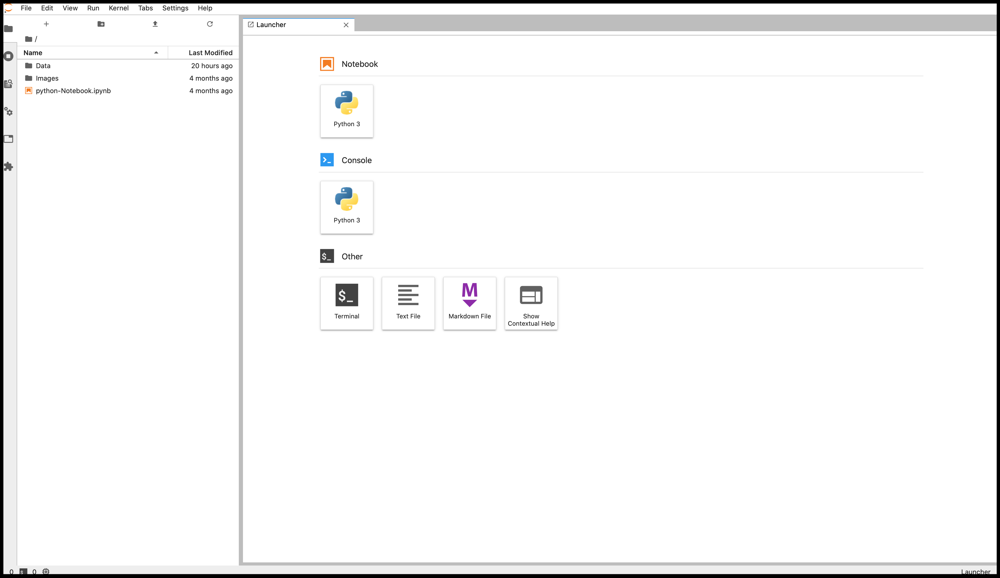

# DockerJup-Lab: Jupiter-lab on Docker 

With this repository I will show you how to deploy Jupiter-lab on Docker. Already ready-to-run Docker images containing Jupiter applications and interactive computing tools exist as you an see in the [Jupiter-docker-stack GitHub repository](https://github.com/jupyter/docker-stacks) (created and maintained by the official Jupiter team).

**However what if we are not satisfied with these images ready-to-run and we what to have one tailored to our needs?**


## Fast way to download the image and run the project:

1) Download this repository locally and using the terminal/command-propt direct you there

1) Run the following code to download the dockJup-lab image and run then create a container showing the example files located inside the folder "Notebook"(an alternative can be to create a new folder with inside a folder called "Notebook" that contains the files you need):
```
docker run -d -v "/${PWD}/Notebook:/SRC/Notebook" --name "dockjup-lab" -p 8888:8888 --restart always --shm-size 2g sicilian4ever/dockjup-lab
```
2) Access the following web page: **localhost:8888**

3) Log-in to your personal space (Password=sicilian4ever):

<center>
    
</center>

4) Then you will able to access your Jupiter-lab working space:

<center>
    
</center>

## The Docker image of this project can be found in the official Docker registry accessible by using the link below:

**[https://hub.docker.com/r/sicilian4ever/dockjup-lab](https://hub.docker.com/r/sicilian4ever/dockjup-lab)**

Have fun!! :)
